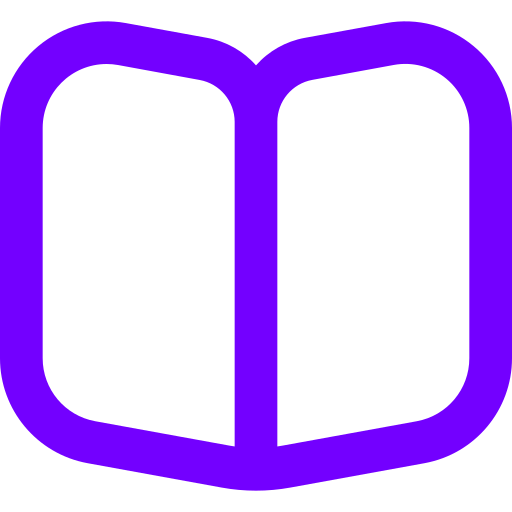
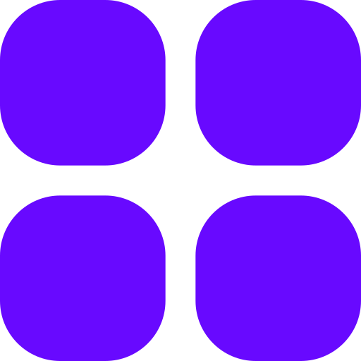

<h2 align="center">Hi  I'm Nei Rin Zara Lwin</h2>

𝐈'𝐦 𝐚𝐧 𝐀𝐈, 𝐌𝐚𝐜𝐡𝐢𝐧𝐞 𝐋𝐞𝐚𝐫𝐧𝐢𝐧𝐠, 𝐃𝐞𝐞𝐩 𝐋𝐞𝐚𝐫𝐧𝐢𝐧𝐠 𝐄𝐧𝐭𝐡𝐮𝐬𝐢𝐚𝐬𝐭

 - 𝙋𝙤𝙧𝙩𝙛𝙤𝙡𝙞𝙤

- 🔭 I’m currently an university student
- 🌱 I’m currently learning Machine Learning & Deep Learning
- 💬 Ask me about some theories of Machine Learning
- 📫 Reach me through  

- 😄 Pronouns: Nei Rin 
- ⚡ Fun fact: Busy bee, Playing pc games

 - 𝙇𝙖𝙣𝙜𝙪𝙖𝙜𝙚 𝙖𝙣𝙙 𝙏𝙤𝙤𝙡𝙨

 
    <a href = 'https://pytorch.org'></img></a>
    <a href = 'https://www.anaconda.com/'></img></a>
    
    
    
    
    
    
    
 

 
 

